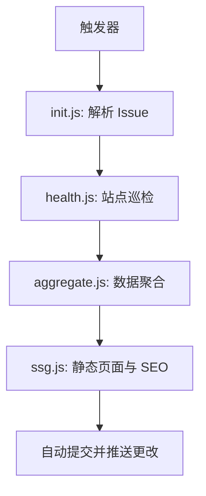
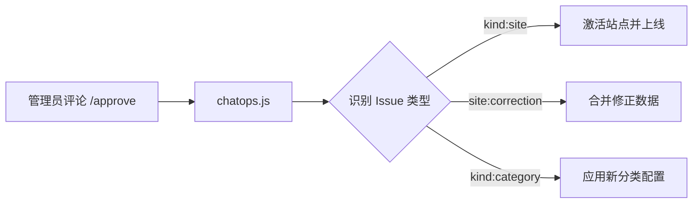

# 🤖 自动化工作流说明 (Automation Workflows)

本文档详细说明了 HubNavigator 项目中所有自动化工作流的触发条件、执行逻辑和数据流转。

---

## 工作流概览

| 工作流名称 | 文件路径 | 触发方式 | 主要功能 |
|:---|:---|:---|:---|
| **Automation Core** | `.github/workflows/automation_core.yml` | 定时 / 手动 / Push | 数据解析、健康检查、数据聚合与 Sitemap 生成 |
| **ChatOps** | `.github/workflows/chatops.yml` | Issue 评论 (`/`) | 处理管理员指令（批准、拒绝、关闭） |
| **Deploy to Pages** | `.github/workflows/deploy.yml` | 定时 / 手动 | 构建 Vue 应用并生成静态页面 |
| **Weekly Backup** | `.github/workflows/backup.yml` | 定时 / 手动 | 备份数据目录到独立分支 |
| **System Init** | `.github/workflows/init.yml` | 手动触发 | 初始化系统配置和基础数据 |

---

## 1. Automation Core (核心自动化)

这是系统的主引擎，负责维护数据的准确性和实时性。

### 触发条件
- 每 30 分钟定时运行。
- `data/items/` 目录下的 JSON 文件发生变更时触发。
- 手动触发。

### 执行流程
1. **数据初始化 (`init.js`)**: 解析所有打开的 Issue，同步 Front Matter 到本地 JSON。
2. **健康检查 (`health.js`)**: 逐个验证站点可用性，更新 `status` (active/warning/broken)。
3. **数据聚合 (`aggregate.js`)**: 将分散的 JSON 文件聚合成 `site_all.json` 和 `category_all.json`。
4. **生成 Sitemap (`ssg.js`)**: 更新站点地图以协助 SEO。

---

## 2. ChatOps (评论命令)

管理员通过 Issue 评论直接控制系统行为。

### 触发条件
- Issue 评论创建。
- 评论内容以 `/` 开头。

### 执行逻辑
由 `automation/chatops.js` 处理，支持以下核心指令：
- **/approve**: 根据 Issue 类型执行批准逻辑（上线站点、添加分类、合并更正）。
- **/reject**: 拒绝申请并清理临时数据。
- **/close**: 关闭 Issue 并按需移除站点。

---

## 3. 数据生命周期

1. **提交**: 用户提交 Issue，系统自动添加 `triage` 标签。
2. **预览**: `automation_core.yml` 捕获新 Issue，生成临时 JSON，数据出现在预览/测试环境。
3. **审核**: 管理员评论 `/approve`。
4. **上线**: 标签变更为 `status:active`，站点正式进入生产环境数据流。
5. **维护**: `health.js` 定期巡检，自动切换可用性状态。
6. **下线**: Issue 关闭，对应 JSON 物理删除，站点从全站数据中移除。

---

## 4. 技术栈

- **Runtime**: Node.js (Latest)
- **API**: GitHub REST API (via `octokit`)
- **Data**: JSON (Stored in `data/`)
- **CI/CD**: GitHub Actions

---

## 相关文档

- [ChatOps 命令手册](./chatops_commands.md)
- [标签体系说明](./issue_labels.md)
- [开发环境配置](./development.md)
