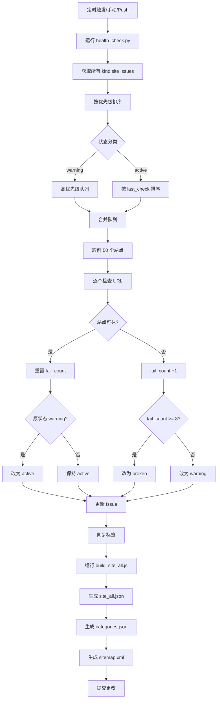
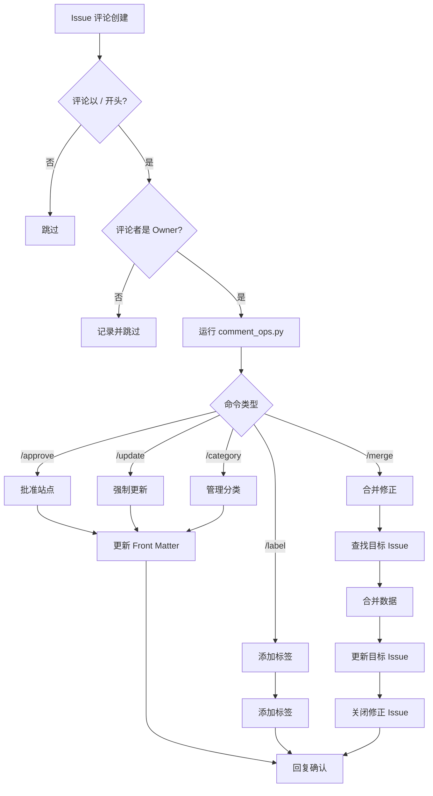
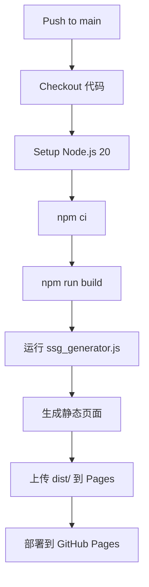
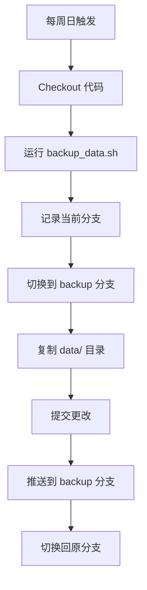
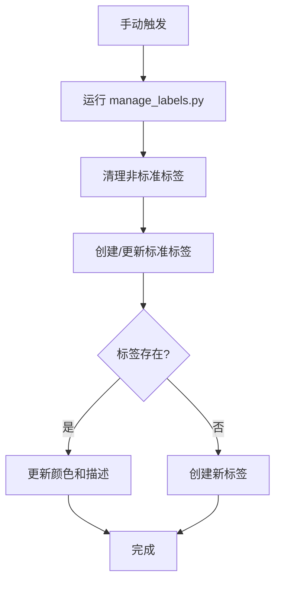
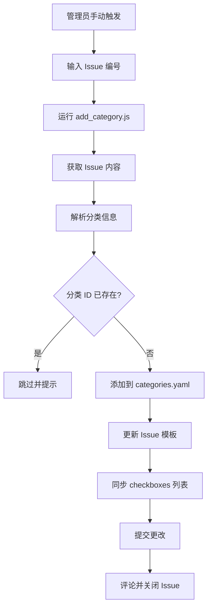
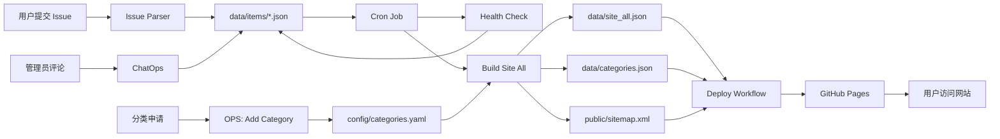

# 🤖 自动化工作流说明 (Automation Workflows)

本文档详细说明了 HubNavigator 项目中所有自动化工作流的触发条件、执行逻辑和数据流转。

---

## 工作流概览

| 工作流名称 | 文件路径 | 触发方式 | 主要功能 |
|:---|:---|:---|:---|
| **Issue Parser** | `.github/workflows/issue_parser.yml` | Issue 变更 | 路由分发解析任务，管理 JSON 生命周期 |
| **Core Automation** | `.github/workflows/cron_job.yml` | 定时 / 手动 / Push | 健康检查、数据聚合与 Sitemap 生成 |
| **ChatOps** | `.github/workflows/ops.yml` | Issue 评论 (`/`) | 处理管理员指令，即时同步站点状态 |
| **Deploy to Pages** | `.github/workflows/deploy.yml` | 定时 / 手动 | 构建 Vue 应用并生成 SEO 详情页 |
| **Weekly Backup** | `.github/workflows/backup.yml` | 每周日定时 / 手动触发 | 同步 `data/` 目录至 `backup` 分支 |
| **Init Labels** | `.github/workflows/init_labels.yml` | 手动触发 / 脚本更新 (Push) | 初始化并规范化仓库的标签体系 |
| **OPS: Add Category** | `.github/workflows/ops_add_category.yml` | 手动触发 | 处理新分类申请并同步 Issue 模板 |

---

### 1. Issue Parser (自动化解析路由)

该工作流是数据入库的入口，采用模块化设计：

1. **触发**: 由 `issue_parser.yml` 捕获 Issue 事件。
2. **路由**: `automation/core/issue_router.js` 识别 `kind` 标签并分发：
   - `kind:site` / `kind:correction` / `kind:domain-migration` -> `parsers/site_parser.js`
   - `kind:new-category` -> `parsers/category_parser.js`
3. **门控 (Triage Gate)**: 若含 `triage` 标签，仅同步 Front Matter，**不生成**物理 JSON。
4. **生命周期**:
   - **创建/移除 Triage**: 生成或更新 `data/items/` 下的 JSON。
   - **关闭 (Closed)**: 物理删除对应 JSON 文件，实现数据的下线。
   - **重开 (Reopened)**: 重新根据 Issue 内容生成 JSON。

### 关键脚本
**`scripts/parser.js`**

**主要功能**：
1. **格式检测**：判断 Issue 是否已包含 Front Matter
2. **表单解析**：从 GitHub Issue Forms 提取字段值
3. **数据规范化**：
   - 新站点：`status: active`
   - 修正/迁移：`status: triage`（需审核）
4. **ID 提取**：从用户输入中智能提取目标站点 ID
5. **多分类支持**：解析 checkboxes 格式的分类选择
6. **生命周期管理**：
   - `Issue Closed`：自动删除对应的 JSON 文件。
   - `Issue Reopened`：自动根据 Issue 内容重新生成 JSON 文件。
7. **数据同步**：执行后自动触发 `build_site_all.js` 确保聚合数据实时更新。

**输出示例**：
```json
{
  "id": "site_issue_123",
  "name": "ChatGPT",
  "url": "https://chat.openai.com",
  "categories": ["ai-chat", "ai-writing"],
  "cover": "",
  "description_md": "OpenAI 的对话式 AI 工具...",
  "added_at": "2026-01-11",
  "last_check": "2026-01-11 00:00",
  "status": "active"
}
```

---

## 2. Core Automation（核心自动化）

### 触发条件
```yaml
on:
  schedule:
    - cron: '*/30 * * * *'  # 每 30 分钟
  workflow_dispatch:         # 手动触发
  push:
    paths:
      - 'data/items/**.json'
      - 'scripts/**'
```

### 执行流程



### 关键脚本

**`scripts/health_check.py`**
- **检查限制**：每次最多检查 50 个站点
- **优先级**：`warning` 状态优先，其次按 `last_check` 时间升序
- **超时设置**：10 秒
- **User-Agent**：`Mozilla/5.0 (compatible; HubNavigatorBot/1.0)`

**`scripts/build_site_all.js`**
- **过滤规则**：仅包含 `status: active` 或 `status: warning` 的站点
- **排序**：按 ID 降序
- **输出文件**：
  - `data/site_all.json`：前端数据源
  - `data/categories.json`：分类配置
  - `public/sitemap.xml`：SEO 站点地图

---

## 3. ChatOps（评论命令）

### 触发条件
```yaml
on:
  issue_comment:
    types: [created]
```

### 过滤条件
- 评论以 `/` 开头
- 不在 Pull Request 中

### 执行流程



### 关键脚本
**`scripts/comment_ops.py`**

**支持的命令**：
- `/approve`：激活站点
- `/update`：触发健康检查
- `/category add/del <id>`：管理分类
- `/merge`：合并修正/迁移
- `/label <labels>`：批量添加标签

详细说明见 [`chatops_commands.md`](./chatops_commands.md)

---

## 4. Deploy to Pages（部署到 GitHub Pages）

### 触发条件
```yaml
on:
  schedule:
    - cron: '0 0 * * *'  # 每天北京时间 08:00
  workflow_dispatch:      # 手动触发
```

### 执行流程



### 关键脚本
**`scripts/ssg_generator.js`**
- **功能**：为每个站点生成独立的 HTML 页面
- **SEO 优化**：注入 meta 标签（title, description, og:image）
- **SPA 支持**：生成 `404.html` 用于客户端路由回退

---

## 5. Weekly Backup（每周备份）

### 触发条件
```yaml
on:
  schedule:
    - cron: '0 0 * * 0'  # 每周日 00:00
  workflow_dispatch:
```

### 执行流程



### 关键脚本
**`scripts/backup_data.sh`**
- **备份内容**：`data/` 目录下的所有文件
- **备份分支**：`backup`
- **保留历史**：所有备份记录都保留在 Git 历史中

---

## 6. Init Labels（初始化标签）

### 触发条件
```yaml
on:
  push:
    paths:
      - 'scripts/manage_labels.py' # 脚本更新时自动运行
  workflow_dispatch:               # 手动触发
```

### 执行流程



### 关键脚本
**`scripts/manage_labels.py`**

**标准标签列表**：
- `status:active`
- `status:warning`
- `status:broken`
- `status:duplicate`
- `kind:site`
- `kind:correction`
- `kind:domain-migration`
- `kind:new-category`
- `triage`

---

## 7. OPS: Add New Category（新增分类）

### 触发条件
```yaml
on:
  workflow_dispatch:
    inputs:
      issue_number:
        description: 'Issue number of the category request'
        required: true
```

### 执行流程



### 关键脚本
**`scripts/add_category.js`**

**功能**：
1. 解析 `kind:new-category` Issue 的表单内容
2. 提取分类信息：
   - `id`：分类 ID
   - `name`：中文名称
   - `name_en`：英文名称
   - `icon`：图标 emoji
   - `description`：中文描述
   - `desc_en`：英文描述
3. 更新 `config/categories.yaml`
4. 同步更新以下模板的 checkboxes：
   - `site_submission.yml`
   - `site_correction.yml`
5. 自动提交并关闭申请 Issue

---

## 数据流转图



---

## 环境变量说明

所有工作流使用以下环境变量：

| 变量名 | 来源 | 用途 |
|:---|:---|:---|
| `GITHUB_TOKEN` | GitHub Secrets | API 调用认证 |
| `GITHUB_REPOSITORY` | GitHub Context | 仓库标识 |
| `ISSUE_NUMBER` | GitHub Context / Input | Issue 编号 |
| `ISSUE_BODY` | GitHub Context | Issue 内容 |
| `ISSUE_LABELS` | GitHub Context | Issue 标签列表 |
| `COMMENT_BODY` | GitHub Context | 评论内容 |
| `COMMENT_AUTHOR` | GitHub Context | 评论者用户名 |

---

## 最佳实践

### 1. 新站点提交流程
1. 用户填写 `site_submission.yml` 表单
2. Issue Parser 自动解析并生成 JSON
3. Cron Job 在 30 分钟内进行首次健康检查
4. 如果站点可达，自动收录到 `site_all.json`
5. 下次部署时自动上线

### 2. 站点修正流程
1. 用户填写 `site_correction.yml` 表单（提供站点 ID）
2. Issue Parser 解析并标记为 `status: triage`
3. 管理员审核后评论 `/merge`
4. ChatOps 自动更新目标站点并关闭修正 Issue
5. Cron Job 触发数据同步

### 3. 分类管理流程
1. 用户填写 `new_category.yml` 表单
2. 管理员审核后手动触发 `OPS: Add New Category` 工作流
3. 脚本自动更新配置文件和 Issue 模板
4. 下次数据同步时新分类生效

---

## 故障排查

### Issue Parser 未触发
- 检查 Issue 是否包含必需的标签
- 查看 Actions 日志确认工作流是否运行

### 健康检查失败
- 确认站点 URL 格式正确
- 检查是否有防爬虫机制
- 查看 `fail_count` 和 `last_check` 字段

### ChatOps 命令无响应
- 确认评论者是仓库 Owner
- 检查命令格式是否正确
- 查看 Actions 日志确认错误信息

### 数据未同步到前端
- 确认站点 `status` 为 `active` 或 `warning`
- 检查 `data/site_all.json` 是否包含该站点
- 确认最近一次部署是否成功
