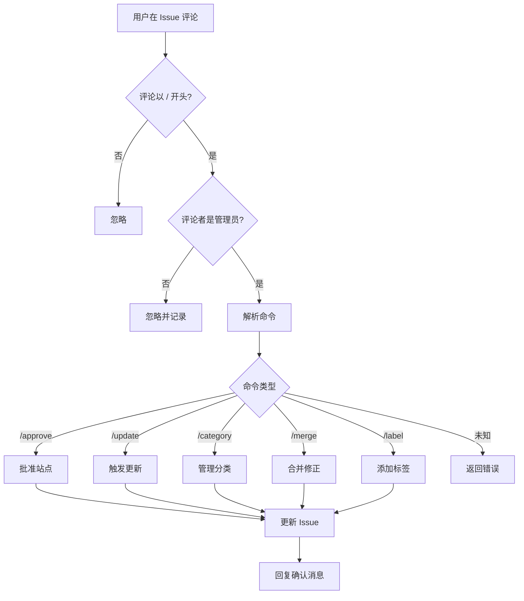

# 💬 ChatOps 命令手册 (ChatOps Commands)

本文档列出了所有可用的 ChatOps 命令。这些命令通过在 Issue 评论中输入特定指令来触发自动化操作。

## 权限说明

**仅限管理员使用**：所有命令仅对仓库所有者 (Owner) 有效。其他用户的命令将被忽略。

---

## 1. 站点审核命令

### `/approve`

**用途**：批准一个新站点提交，将其状态从 `triage` 更改为 `active`。

**适用场景**：
- 新站点提交 (`kind:site`)
- 需要人工审核通过的站点

**执行效果**：
1. 更新 Issue 的 Front Matter，设置 `status: active`
2. 重置 `fail_count` 为 0
3. 移除 `triage` 标签，添加 `status:active` 标签
4. 在 Issue 下方自动回复确认消息

**使用示例**：
```
/approve
```

---

## 2. 站点更新命令

### `/update`

**用途**：强制触发一次健康检查，立即重新验证站点可用性。

**适用场景**：
- 站点刚刚修复，需要立即验证
- 手动触发巡检

**执行效果**：
1. 将 `last_check` 时间重置为 `2000-01-01 00:00`
2. 下一次 Cron Job 运行时会优先检查此站点

**使用示例**：
```
/update
```

---

## 3. 分类管理命令

### `/category add <category-id>`

**用途**：为站点添加一个新的分类标签。

**参数**：
- `<category-id>`：分类 ID，例如 `ai-chat`、`dev-tools`

**执行效果**：
1. 在 Issue 的 `categories` 字段中添加指定分类
2. 自动回复确认消息

**使用示例**：
```
/category add ai-chat
```

### `/category del <category-id>`

**用途**：从站点移除一个分类标签。

**参数**：
- `<category-id>`：要移除的分类 ID

**执行效果**：
1. 从 Issue 的 `categories` 字段中移除指定分类
2. 自动回复确认消息

**使用示例**：
```
/category del dev-tools
```

---

## 4. 修正合并命令

### `/merge`

**用途**：将修正申请 (`kind:correction`) 或域名迁移 (`kind:domain-migration`) 的内容合并到目标站点。

**适用场景**：
- 用户提交了站点信息修正
- 用户提交了域名变更申请
- 管理员审核通过后需要应用更改

**执行效果**：

**对于修正申请 (`kind:correction`)**：
1. 读取修正 Issue 的 `target_id` 字段
2. 找到对应的目标站点 Issue
3. 更新目标站点的以下字段（如果提供）：
   - `name`：站点名称
   - `url`：站点链接
   - `categories`：分类列表
4. 在目标站点 Issue 下方添加更新说明
5. 关闭修正 Issue 并标记为 `status:active`

**对于域名迁移 (`kind:domain-migration`)**：
1. 读取迁移 Issue 的 `target_id` 字段
2. 找到对应的目标站点 Issue
3. 更新目标站点的 `url` 字段为新域名
4. 在目标站点 Issue 下方添加迁移说明（包含旧域名和新域名）
5. 关闭迁移 Issue 并标记为 `status:active`

**使用示例**：
```
/merge
```

**注意事项**：
- 确保修正/迁移 Issue 的 `target_id` 字段正确
- 建议在执行前先预览修正内容
- 合并后会自动触发数据同步

---

## 5. 标签管理命令

### `/label add <label1> add <label2> remove <label3> ...`

**用途**：批量添加或删除 Issue 标签。

**参数**：
- `add <label>`：添加一个标签
- `remove <label>` 或 `del <label>`：删除一个标签
- 可以在一条命令中混合使用多个 `add` 和 `remove`

**执行效果**：
1. 按顺序执行所有添加和删除操作
2. 如果删除的标签不存在，会给出提示但不会报错
3. 自动回复操作结果

**使用示例**：

**示例 1：添加单个标签**
```
/label add status:warning
```

**示例 2：批量添加多个标签**
```
/label add status:warning add bot:check-fail
```

**示例 3：删除标签**
```
/label remove triage
```

**示例 4：同时添加和删除**
```
/label add status:active remove triage
```

**示例 5：复杂批量操作**
```
/label add status:warning add bot:check-fail remove status:active remove triage
```

**注意事项**：
- 标签名称区分大小写
- 如果标签不存在会自动创建（添加时）
- 删除不存在的标签会显示警告但不会中断操作

---

## 6. Issue 管理命令

### `/close [reason]`

**用途**：快速关闭当前 Issue，可选择性提供关闭原因。

**参数**：
- `[reason]`：可选，关闭原因说明

**执行效果**：
1. 将 Issue 状态设置为 `closed`
2. 添加关闭确认评论
3. **自动删除**对应的站点数据文件 (`data/items/*.json`)
4. 立即重新构建 `site_all.json`，站点从前端下架
5. 如果提供了原因，会在评论中显示

**使用示例**：

**示例 1：直接关闭**
```
/close
```

**示例 2：带原因关闭**
```
/close 重复提交
```

**示例 3：英文原因**
```
/close Duplicate submission
```

**适用场景**：
- 重复的 Issue
- 无效的提交
- 已解决的问题
- 不符合收录标准的站点

---

## 命令执行流程



---

## 常见使用场景

### 场景 1：批准新站点
1. 用户提交新站点 Issue
2. 管理员审核内容
3. 在 Issue 下评论 `/approve`
4. 系统自动激活站点

### 场景 2：处理站点修正
1. 用户提交修正 Issue（填写站点 ID）
2. 管理员审核修正内容
3. 在修正 Issue 下评论 `/merge`
4. 系统自动更新目标站点并关闭修正 Issue

### 场景 3：域名迁移
1. 用户提交域名迁移 Issue（填写站点 ID 和新旧域名）
2. 管理员确认域名有效
3. 在迁移 Issue 下评论 `/merge`
4. 系统自动更新站点 URL 并关闭迁移 Issue

### 场景 4：调整分类
1. 发现站点分类不准确
2. 在站点 Issue 下评论 `/category add <new-category>`
3. 如需移除旧分类，评论 `/category del <old-category>`
4. 系统自动更新分类

---

## 错误处理

如果命令执行失败，系统会在 Issue 下方回复错误消息，常见错误包括：

- **❌ 权限不足**：非管理员尝试执行命令
- **❌ 目标 ID 无效**：`/merge` 命令找不到目标站点
- **❌ 类型不匹配**：在非修正/迁移 Issue 上使用 `/merge`
- **❌ 缺少必填字段**：Issue 的 Front Matter 缺少必要信息

---

## 技术实现

所有 ChatOps 命令由 `scripts/comment_ops.py` 处理，通过 `.github/workflows/ops.yml` 工作流触发。

**工作流触发条件**：
- 事件：`issue_comment.created`
- 过滤：评论以 `/` 开头且不在 Pull Request 中

**环境变量**：
- `GITHUB_TOKEN`：用于 API 调用
- `ISSUE_NUMBER`：当前 Issue 编号
- `COMMENT_BODY`：评论内容
- `COMMENT_AUTHOR`：评论者用户名
