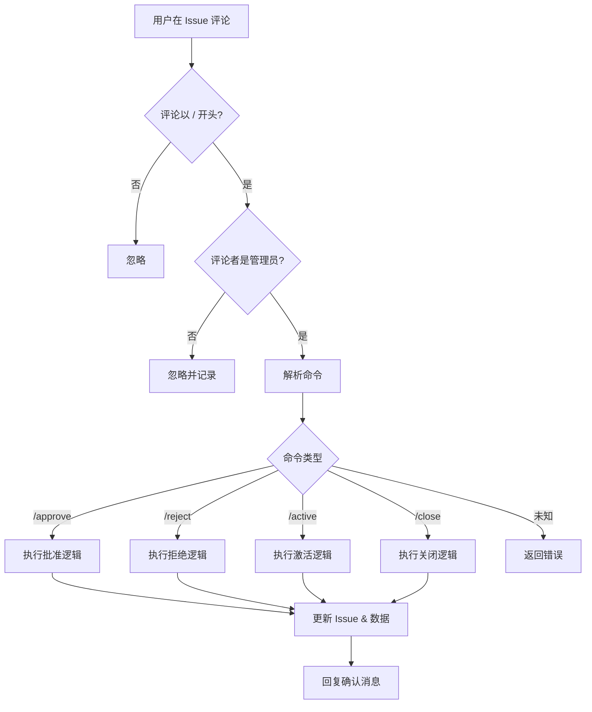

# 💬 ChatOps 命令手册 (ChatOps Commands)

本文档列出了所有可用的 ChatOps 命令。这些命令通过在 Issue 评论中输入特定指令来触发自动化操作。

## 权限说明

**仅限管理员使用**：所有命令仅对仓库所有者 (Owner) 有效。其他用户的命令将被忽略。

---

## 1. 审核与批准命令

### `/approve`

**用途**：批准并执行 Issue 相关的自动化操作。

**适用场景**：
- **新站点提交 (`kind:site`)**：将状态更改为 `active` 并上线。
- **分类申请 (`kind:category`)**：正式添加新分类并关闭 Issue。
- **信息修正 (`site:correction`)**：将更正的内容合并到目标站点并关闭 Issue。
- **删除分类 (`category:delete`)**：删除指定分类并关闭 Issue。

**执行效果**：
1. 更新 Issue 状态和标签。
2. 执行对应的数据操作（生成 JSON、更新文件、删除文件等）。
3. 在 Issue 下方自动回复确认消息。

**使用示例**：
```
/approve
```

---

## 2. 拒绝命令

### `/reject [reason]`

**用途**：拒绝当前的申请，并关闭 Issue。

**参数**：
- `[reason]`：可选，拒绝原因说明。

**适用场景**：
- 站点不符合收录标准。
- 分类申请重复或不合理。
- 修正内容错误。

**执行效果**：
1. 移除 `triage` 标签。
2. 关闭 Issue。
3. 清理该 Issue 产生的临时数据文件。
4. 回复拒绝消息（包含原因，如果提供）。

**使用示例**：
```
/reject 不符合收录标准
```

---

## 3. 关闭命令

### `/close [reason]`

**用途**：快速关闭 Issue 并清理相关数据。

**参数**：
- `[reason]`：可选，关闭原因说明。

**适用场景**：
- 重复提交。
- 用户自行取消申请。
- 无需执行任何数据合并的关闭操作。

**执行效果**：
1. 关闭 Issue。
2. 清理临时数据文件。
3. 如果是已上线的站点 Issue，对应的站点文件 (`data/items/*.json`) 将被删除。

**使用示例**：
```
/close 已经在其他 Issue 中处理
```

## 4. 恢复命令

### `/active`

**用途**：手动将站点或分类的状态恢复为 `active`。

**适用场景**：
- 被 `health.js` 误判为 `broken` 的站点在修复后需快速上线。
- 手动撤销 `/reject` 或 `/close` 操作（如果对应文件仍存在）。

**执行效果**：
1. 移除 `status:broken`、`status:warning` 或 `triage` 标签。
2. 添加 `status:active` 标签。
3. 更新对应的本地 JSON 数据文件，将其 `status` 设为 `active`。

**使用示例**：
```
/active
```

---

## 命令执行流程



---

## 常见使用场景

### 场景 1：批准新站点
1. 用户提交新站点 Issue。
2. 管理员审核通过。
3. 评论 `/approve`。
4. 系统自动激活站点并上线。

### 场景 2：拒绝无效提交
1. 发现提交的站点链接失效或内容违规。
2. 评论 `/reject URL 已失效`。
3. 系统自动关闭 Issue。

### 场景 3：合并站点修正
1. 用户提交 `site:correction` Issue。
2. 管理员确认修正内容。
3. 评论 `/approve`。
4. 系统自动同步数据到原站点文件并关闭修正 Issue。

---

## 技术实现

所有 ChatOps 命令由 `automation/chatops.js` 处理，通过 `.github/workflows/chatops.yml` 工作流触发。

**工作流触发条件**：
- 事件：`issue_comment.created`
- 过滤：评论以 `/` 开头。

**环境变量**：
- `GITHUB_TOKEN`：用于 API 调用。
- `ISSUE_NUMBER`：当前 Issue 编号。
- `COMMENT_BODY` : 评论内容。
- `COMMENT_AUTHOR` : 评论者用户名。
