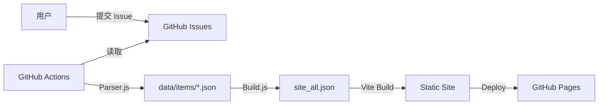

# 🛠️ 开发指南 (Development Guide)

欢迎参与 HubNavigator 的开发！HubNavigator 是一个高度自动化的导航站系统，本文档详细说明了系统的技术架构及其开发流程。

---

## 🏗️ 技术架构

HubNavigator 采用 **"Issue 即数据库"** 的理念。



1.  **数据源**：GitHub Issues。
2.  **解析层**：`parser.js` 将 Issue 表单解析为标准的 JSON。
3.  **处理层**：`health_check.py` 巡检站点，`comment_ops.py` 处理 ChatOps 命令。
4.  **构建层**：`build_site_all.js` 聚合数据，Vite 构建前端。
5.  **展示层**：Vue 3 + TailwindCSS 的响应式页面。

---

## 💻 环境准备

### 1. 软件要求
- **Node.js**: v20.0.0+ (LTS)
- **npm**: 10.x+

### 2. 克隆与安装
```bash
git clone https://github.com/ACG-Q/hubNavigator.git
cd hubNavigator

# 前端依赖
npm install

# 后端脚本依赖
pip install -r requirements.txt
```

---

## 🔧 前端开发

### 1. 全局配置
修改 `src/config.js` 以调整站点名称、URL、Giscus 评价系统及其它元数据。

### 2. 多语言支持 (i18n)
语言文件位于 `src/i18n/index.js`。
如需添加词条，请确保 `en` 和 `zh` 分支下键名一致。

### 3. 运行开发服务器
```bash
npm run dev
```
前端默认从 `data/site_all.json` 读取数据。

---

## 🐍 后端脚本详解

| 脚本路径 (Path) | 功能描述 (Description) |
| :--- | :--- |
| `automation/core/issue_router.js` | **核心路由**: 根据标签分发解析任务（入口） |
| `automation/parsers/site_parser.js` | **站点解析**: 处理提交、修正、迁移，管理 JSON 生命周期 |
| `automation/parsers/category_parser.js` | **分类解析**: 处理新增分类申请并同步配置 |
| `automation/core/ops_handler.js` | **指令处理**: 实现 ChatOps（如 `/approve`, `/update`） |
| `automation/core/health_checker.js` | **健康检查**: 定时巡检站点链接有效性，自动同步标签 |
| `automation/core/data_aggregator.js` | **数据聚合**: 汇总 JSON，生成 `site_all.json` 与 Sitemap |
| `automation/utils/init_labels.js` | **标签定义**: 统一维护 GitHub 仓库的标签体系 |

---

## 🧪 本地调试工作流

### 1. 模拟 Parser 解析
如果你修改了 `parser.js`，可以使用以下指令本地模拟 Actions 环境：

```bash
# 设置模拟负载
export ISSUE_NUMBER="10"
export ISSUE_BODY="...粘贴 Issue 的 Markdown 内容..."
export ISSUE_LABELS="kind:site,triage"
export ISSUE_STATE="open"
export GITHUB_TOKEN="your_personal_access_token" # 选填

node scripts/parser.js
```

### 2. 模拟巡检逻辑
```bash
# 巡检脚本会自动读取 data/items/ 下的所有 JSON 文件
python scripts/health_check.py
```

### 3. 本地构建完整数据
```bash
# 在 data/items/ 修改完数据后，运行此脚本更新 index
node scripts/build_site_all.js
```

---

## 🚀 进阶任务

### 如何添加一个新分类？
1. 修改 `config/categories.yaml`，添加新的分类条目。
2. 运行 `node scripts/build_site_all.js` 以更新 `data/categories.json`。
3. (可选) 手动运行 `node scripts/add_category.js` 来同步更新 Issue 模板的 checkboxes。

### 如何修改 Issue 模板？
1. 修改 `.github/ISSUE_TEMPLATE/` 下的 `.yml` 文件。
2. 注意不要破坏 `id: ...` 等 parser 强依赖的键名。

---

## 📜 提交规范
本仓库推荐使用 [Conventional Commits](https://www.conventionalcommits.org/zh-hans/v1.0.0/) 规范：
- `feat`: 新功能
- `fix`: 修复问题
- `docs`: 文档变更
- `style`: 代码格式调整
- `chore`: 构建过程或辅助工具变动

---

## TODO

- [ ] 完善多语言支持，目前支持中英文切换
- [ ] 完善自动化工作流
- [ ] 完善多主题支持
- [ ] 详情页面，添加网页预览图片
- [ ] 网站直达
  - [ ] 添加新的站点
  - [ ] 添加新的分类
  - [ ] 添加新的标签
    - [ ] 添加新标签的自动化
- [ ] 完善config.js
  - [ ] 完善Giscus 评论配置

---

## ❓ 常见问题排查
- **Node 脚本报错 "matter is not defined"**: 确保已运行 `npm install` 安装 `gray-matter`。
- **Python 脚本 403 错误**: 检查是否提供了有效的 `GITHUB_TOKEN`，且该 Token 具有对应的权限。
- **健康检查不跳状态**: 检查站点的 `fail_count`。只有连续失败 3 次以上才会变更为 `broken`。
